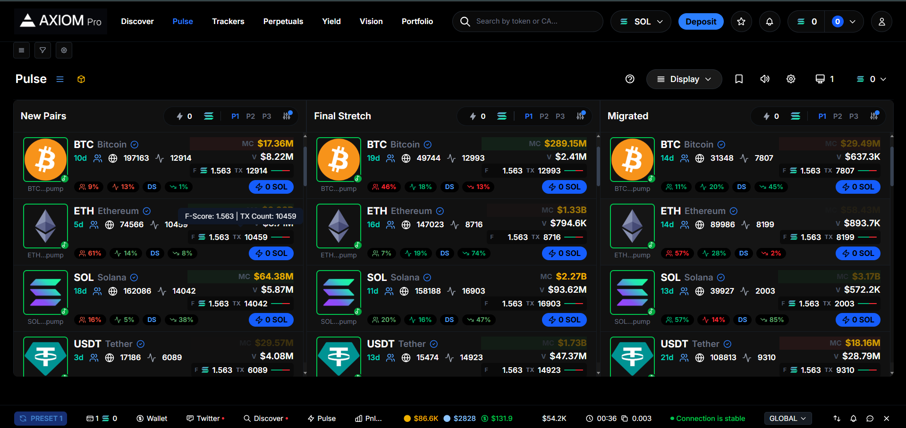
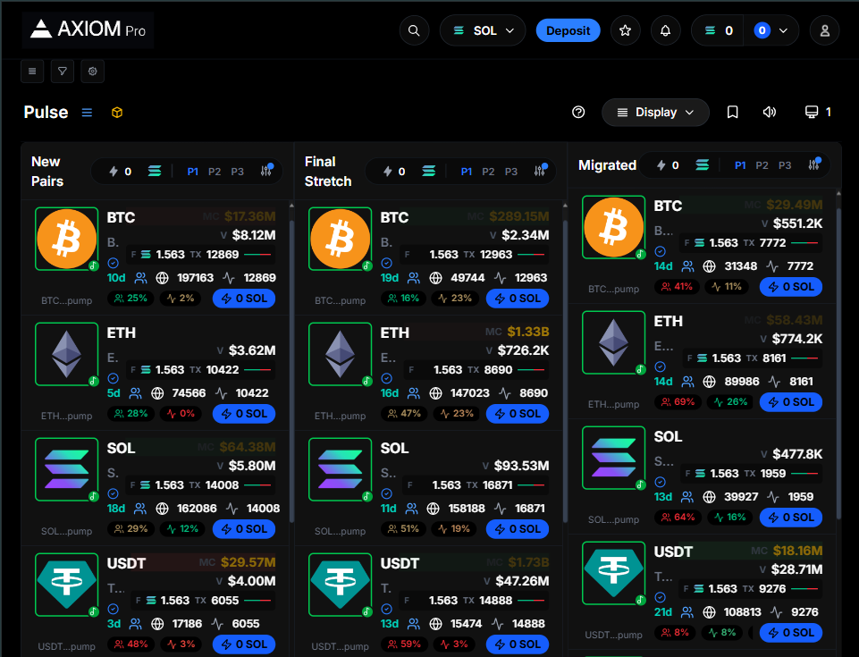
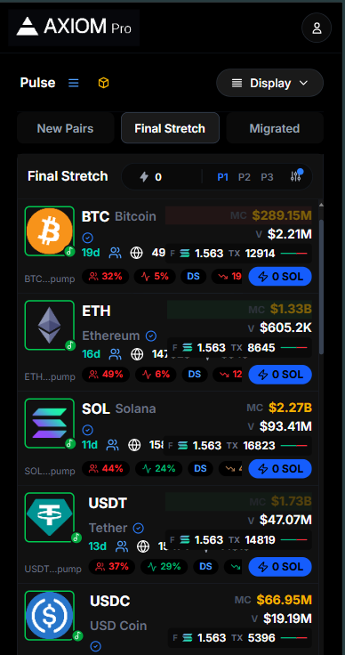

# Eterna Frontend - Axiom Trade Pulse Replica

Welcome to the Eterna Frontend project, a sophisticated web application designed to replicate the Pulse section of Axiom Trade. This platform is built using Next.js 16, TypeScript, and a suite of modern web technologies, providing users with a seamless experience in token discovery.

## Live Demo

You can view the live application at [Eterna Labs Axiom Replica](https://eterna-labs-axiom-replica.vercel.app/).

## Video Demonstration

Watch a quick demonstration of the application's functionality on YouTube: [Eterna Frontend Demo](https://youtu.be/jKngLnH_Iyw).

## Getting Started

To set up the project on your local machine, follow these steps:

```bash
# Clone the repository
git clone https://github.com/ashug06/Eterna-labs-Axiom-replica.git

# Install all dependencies
npm install

# Start the development server
npm run dev

# Build the application for production
npm run build

# Launch the production server
npm start
```

You can access the application at [http://localhost:3000](http://localhost:3000).

## Key Features

### Token Discovery Interface
- **Categories**: Explore tokens across three distinct sections: New Pairs, Final Stretch, and Migrated.
- **Real-Time Updates**: Prices refresh every 2 seconds, ensuring users have the latest information.
- **Progressive Loading**: Efficiently loads up to 100 tokens per column, enhancing user experience.

### Responsive Design
- **Desktop View**: A three-column layout with independent scrolling for each section (≥ 1024px).
- **Tablet View**: Tabbed navigation within the grid for devices between 640px and 1024px.
- **Mobile View**: Tabbed navigation outside the grid for screens smaller than 640px.
- Fully optimized for widths down to 320px.

### Interactive Elements
- **Tooltips**: Implemented using Radix UI for improved accessibility.
- **Filter Modal**: Users can sort tokens based on various metrics.
- **Image Preview Popover**: Displays additional information when hovering over tokens.
- **Sorting Options**: Sort tokens by market cap, volume, price, or age.

### Performance Metrics
- Achieves a Lighthouse score of 90+ on both mobile and desktop platforms.
- Utilizes React Query for infinite scrolling and efficient data fetching.
- Implements memoization techniques to optimize rendering performance.

## Technical Stack

- **Framework**: Next.js 16.0.3 (with App Router and Turbopack)
- **Language**: TypeScript 5.x (strict mode)
- **Styling**: Tailwind CSS 4.1.17
- **State Management**: Redux Toolkit
- **Data Fetching**: TanStack Query v5
- **UI Components**: Radix UI for accessible components

## Project Structure Overview

```
src/
├── components/
│   ├── atoms/          # Basic UI elements (Button, Badge, Avatar, IconButton)
│   ├── molecules/      # Composed UI elements (Tooltip, Modal, Popover)
│   ├── organisms/      # Complex components (TokenCardGrid, TokenTable)
│   └── providers/      # Context providers for Redux and React Query
├── hooks/
│   └── useWebSocketMock.ts
├── lib/
│   ├── api.ts         # API calls and data fetching logic
│   └── mockData.ts    # Mock data generation for testing
├── store/
│   ├── slices/        # Redux slices for state management
│   └── hooks.ts       # Custom hooks for typed Redux access
├── types/             # TypeScript type definitions
└── utils/             # Utility functions and formatters

app/
├── layout.tsx         # Main layout component with providers
├── page.tsx           # Home page component
└── globals.css        # Global styles and configurations
```

## Implementation Insights

### Infinite Scrolling
- Initial load of 60 tokens (20 per column).
- Progressive loading of 20 tokens as the user scrolls down.
- Total capacity of 100 tokens per column, with a scroll trigger set at 200px from the bottom.

### Real-Time Price Updates
- Simulated WebSocket updates using setInterval.
- Randomly updates 2-5 tokens every 2 seconds.
- Maintains dual state management with Redux for UI and React Query for caching.

### Memoization Techniques
- Utilizes `React.memo` for components like TokenCard and TokenColumn.
- Employs `useCallback` and `useMemo` to optimize performance and prevent unnecessary re-renders.

## Performance Enhancements

### Bundle Optimization
- Dynamic imports for code splitting.
- Tree-shaking to eliminate unused code.
- CSS minification for reduced file size.

### Rendering Improvements
- React.memo for heavy components.
- CSS containment to limit repaints.
- GPU-accelerated animations for smoother transitions.

### Data Management
- React Query cache duration set to 10 minutes.
- Stale time configured to Infinity to avoid unnecessary refetching.
- WebSocket initialization delayed for 1.5 seconds after component mount.

### Image Handling
- Implements lazy loading for images.
- Uses AVIF and WebP formats for better compression.
- Explicit width and height attributes to prevent layout shifts.

### Font Optimization
- Uses the Inter font with a swap display strategy.
- Preloads critical font files for faster rendering.

## Configuration Files

**next.config.ts**
```typescript
{
  compress: true,
  output: 'standalone',
  images: {
    formats: ['image/avif', 'image/webp'],
    minimumCacheTTL: 60,
  },
  experimental: {
    optimizePackageImports: ['lucide-react'],
    optimizeCss: true,
  }
}
```

**tsconfig.json**
```json
{
  "compilerOptions": {
    "strict": true,
    "noUncheckedIndexedAccess": true,
    "paths": { "@/*": ["./src/*"] }
  }
}
```

## Environment Variables

No environment variables are required for local development. For production API integration, set the following:

```bash
NEXT_PUBLIC_API_URL=your-api-url
NEXT_PUBLIC_WS_URL=your-websocket-url
```

## Development Practices

### Code Quality
- Enforced TypeScript strict mode.
- ESLint configured for Next.js.
- Comprehensive type definitions throughout the codebase.

### State Management
- Redux for UI state and price updates.
- React Query for server state and caching.
- Local state management for component-specific needs.

### Component Design
- Follows atomic design principles.
- Uses JSDoc for prop interfaces.
- Implements error boundaries for robust error handling.

## Browser Compatibility

- Supports modern browsers including Chrome, Firefox, and Safari.

## Responsive Design Screenshots

| Desktop View (1440×900) | Tablet View (1024×768) | Mobile View (375×812) |
|:-----------------------:|:----------------------:|:----------------------:|
|  <br> *Desktop* |  <br> *Tablet* |  <br> *Mobile* |


## Performance Goals

**Lighthouse Metrics**
- Performance: 90+
- Accessibility: 90+
- Best Practices: 100
- SEO: 100

**Core Web Vitals**
- LCP (Largest Contentful Paint): <2.5s
- FID (First Input Delay): <100ms
- CLS (Cumulative Layout Shift): <0.1

**Bundle Size Estimates**
- Main bundle: ~256 KB
- Initial JavaScript: ~142 KB
- CSS: ~12 KB

## Architectural Overview

### Component Breakdown
- **Atoms**: Basic UI components (Button, Badge, Avatar, etc.)
- **Molecules**: Composed UI elements (Tooltip, Modal, etc.)
- **Organisms**: Complex components (TokenCardGrid, TokenTable, etc.)

### DRY Principles
- Shared formatters for currency and price.
- Reusable hooks for common functionality.
- Centralized type definitions for consistency.

### Type Safety
- Achieves comprehensive TypeScript coverage.
- Implements strict null checks.
- Provides detailed interfaces for all components.
